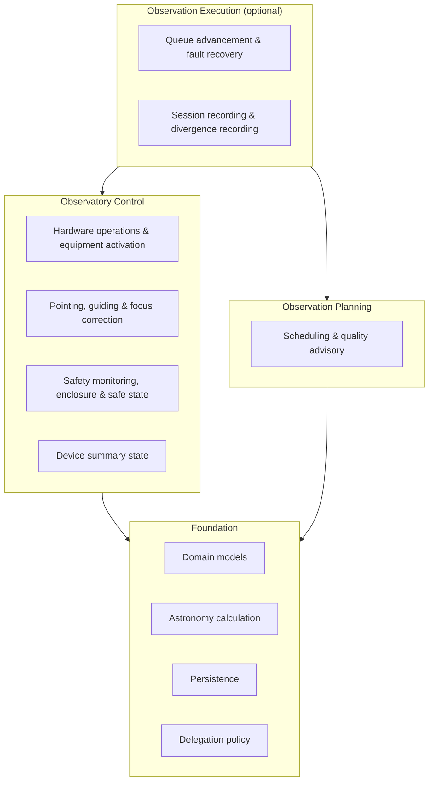
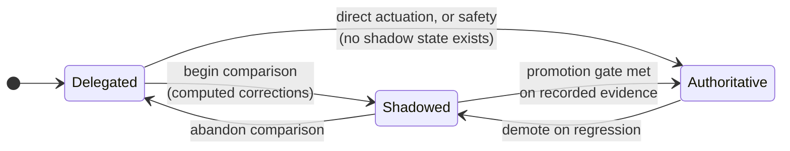

# Wayfinding Library: Architecture and Design

*Version 2.5 · 2026-08-07 · Status: current*

## Overview

This document outlines the architecture for the observatory-side half of the Astrometrics software suite, whose purpose is to operate a single-observer observatory unattended. It is organized around three functions: **Observatory Control**, the direct operation of telescope, camera, enclosure, and mount hardware together with the safety monitoring that protects them; **Observation Planning**, the construction of reusable imaging requests and their arrangement into a feasible night; and **Observation Execution**, the function that carries a planned night out, recording what happened alongside what was intended.

## 1. Introduction

An observing night involves three separable tasks: deciding what to image and in what order, operating the equipment, and executing the plan while adapting to changing conditions. This architecture separates these concerns so each can be built, used, and verified independently.

Observation Planning and Observatory Control are peer functions: an operator can plan a night's targets without ever commanding hardware, and the observatory can protect itself with no plan in existence. Observation Execution sits above both to drive the automation.

This architecture adheres to a strict dual-interface paradigm. The programmatic interfaces that drive these functions are identical to those invoked by any graphical client. Observers can interactively direct the observatory via a user interface, or directly encode those operational maneuvers into scripts for complete automation.

Section 2 presents the architecture and module mappings to the Sphinx API reference. For a direct map of these theoretical algorithms to their internal Python implementations, see the [Wayfinding Library Implementation](./Wayfinding_Library_Implementation.md). Section 3 discusses the core design assumptions.

## 2. Architecture and Design

### 2.1 System Architecture

The architecture is organized as three functions over one shared foundation, illustrated in Figure 1.

**Figure 1.** The three-function architecture. Control and Planning are peers, sharing the Foundation but never importing each other. Execution depends on both; nothing depends on Execution. Safety sits in Control rather than Execution because it must operate whether or not a session is running.

Five rules govern the architecture and are treated as Design Invariants (§2.2–2.5 restate the ones local to each function):

1. **Foundation Independence:** domain models and astronomy calculation depend on nothing above themselves.
2. **Control/Planning Peerage:** Observatory Control and Observation Planning never depend on one another. Either may be exercised in the complete absence of the other.
3. **Execution Is Optional:** Observation Execution may depend on Control, Planning, and the Foundation; nothing outside Execution depends on it. A system built without Execution is a complete, usable planning-and-control system, not a partial one.
4. **One Litmus Test Per Boundary:** a capability belongs to the science-side image processing system (see `Astrometrics_Library_Architecture.md`) if it could be exercised by a scientist with archived data and no telescope; otherwise it belongs here. Applied consistently, this keeps the science system usable without observatory hardware and keeps this system free of astrophysical analysis it does not need.
5. **Delegation Is A Per-Capability State, Not An Architecture Boundary:** which system performs a given hardware-facing capability is configuration read at runtime (§2.1.3), not a structural property of the code. No function may be written such that changing a capability's delegation state requires changing that function's structure.

#### 2.1.1 Precedent and Deliberate Divergence

This decomposition draws precedent from the Vera C. Rubin Observatory's control system, which separates several concerns this architecture also separates, and which are easily conflated.

The first is **component lifecycle**. Rubin represents each piece of hardware as an independently commandable component running one standardized summary-state machine — offline, standby, disabled, enabled, fault — and publishing that state uniformly regardless of what is underneath, with components communicating as peers over a shared bus rather than through a fixed hierarchy [1]. This architecture adopts that concept directly as Device Summary State (§2.5.2), using the same five states, so that an operator or an executing session can ask any device the same question and get an answer in the same vocabulary — including an explicit fault state that execution must consult before advancing and that unattended recovery acts on.

The second is **work-item lifecycle**. Rubin's nightly operation separates a Scheduler, which decides what to observe, from a ScriptQueue, which sequences the resulting work against the hardware layer; queue entries carry their own progression, distinct from the summary state of the components executing them [1]. This architecture's Planning/Execution split has the same shape, and its queue-entry status progression (§2.4) is the analogue of the ScriptQueue entry's, not of the component summary state.

The third is **safety as a layer, not a step**. Rubin treats environmental monitoring and interlocking as concerns that constrain operation from outside it, rather than as stages within the observing sequence [1]. This architecture does the same by placing safety in Observatory Control (§2.5.4), where it functions with or without a session, and by exempting it from the delegation model's shadow requirement (§2.1.2).

Three deliberate divergences are worth stating, since each is a design choice rather than an omission:

* **Granularity.** Rubin decomposes hardware into many independently owned components, appropriate to a facility with separate engineering teams per subsystem. A single-observer setup has no comparable organizational need, so Observatory Control here is one function covering the whole imaging train and enclosure, exposing per-device summary state without a component per device.
* **Scope of the term "control".** Rubin's Observatory Control System encompasses the Scheduler and the ScriptQueue in addition to device commanding. This architecture's Observatory Control function is narrower: it excludes both, which live in Observation Planning and Observation Execution respectively. The narrower scope is what makes Control usable with no plan in existence (Design Invariant 2), and readers familiar with Rubin's usage should not carry the wider meaning across.
* **Scheduling posture.** §2.3.2 treats this in full; in short, Rubin re-scores candidates continuously during the night, while this architecture resolves a queue before the night and advances it statically.

A full terminology correspondence is given in Appendix D.

#### 2.1.2 Capability Delegation

Every hardware-facing capability this system will ultimately perform is performed today by the incumbent third-party software. Rather than treat that as a fixed boundary or as a single future cutover, the architecture models it as a **delegation state** carried independently by each capability, taking one of three values:

* **Delegated** — the incumbent performs the capability; this system neither computes nor commands it, and observes only what the incumbent published.
* **Shadowed** — the incumbent still performs the capability and remains the sole source of hardware commands, while this system independently computes what it would have done and records every divergence between the two (§2.4.4). Nothing this system computes reaches hardware.
* **Authoritative** — this system performs the capability, and the incumbent is disengaged from it.

Six capabilities carry a delegation state, corresponding one-to-one with the functional modules of the software being replaced: mount control, plate-solve alignment, autoguiding, autofocus, capture orchestration, and observatory safety. Because each advances independently, the observatory is fully operational at every intermediate configuration, and a capability that fails to earn promotion can be left delegated indefinitely without blocking the others.

Three invariants govern how a capability may move between states:

* **Computed Corrections Pass Through Shadow:** any capability that computes a *correction* — a pointing adjustment, a guiding pulse, a focus position — may reach the authoritative state only by way of the shadowed state, and only on recorded evidence from real nights. Capabilities that merely actuate an explicit operator command, such as commanding a slew to stated coordinates, have no independently computed counterpart to shadow and are exempt.
* **Safety Is Never Shadowed:** observatory safety may occupy only the delegated or authoritative state. A shadowed safety system — one that computes that it would close the enclosure while the enclosure stays open — is not a validation step but a system that recognizes a hazard and declines to act on it. Safety is therefore promoted on component-level evidence (that each protective action works when commanded) rather than on divergence evidence, and it must be authoritative before unattended operation is permitted at all.
* **Single Command Authority:** for any one device, at most one system holds actuation authority at a time. A capability may occupy the authoritative state only while the incumbent is disengaged from that device. Shadowed is safe precisely because it is defined to issue nothing.

#### 2.1.3 Delegation Phase Progression

The delegation states admit many combinations; Table 1 names the six this architecture targets, in order. Each is a working observatory configuration, not a migration waypoint, and each has a promotion gate stated in the companion implementation paper's verification plan. At Phase 5 no capability remains delegated, which is the concrete meaning of replacing the incumbent: it is uninstalled rather than merely idle.

**Table 1.** Targeted delegation phase progression. **D** delegated · **S** shadowed · **A** authoritative.

| Phase | Mount | Align | Guide | Focus | Capture | Safety | What this phase establishes |
|---|---|---|---|---|---|---|---|
| **0** Observed Baseline | D | D | D | D | D | D | The incumbent runs the night; this system records telemetry and plans nights without commanding anything. |
| **1** Direct Control | **A** | D | D | D | D | D | The mount is commanded through this system's own control path, under its own configured pointing envelope, with device summary state reported. |
| **2** Shadowed Correction | A | **S** | **S** | **S** | D | D | This system's alignment, guiding, and focus algorithms compute corrections on every real night and are measured against the incumbent's, without touching hardware. |
| **3** Assumed Correction | A | **A** | **A** | **A** | D | D | All three corrections run on this system's algorithms; the incumbent still sequences the night. |
| **4** Full Authority | A | A | A | A | **A** | D | Planned sessions are executed end to end by this system, including meridian flips and camera thermal management. The incumbent no longer operates the observatory. |
| **5** Unattended | A | A | A | A | A | **A** | This system protects the observatory itself: environmental monitoring, enclosure control, fault recovery, and safe-state shutdown. The incumbent is removed. |

Figure 2 shows the progression each capability follows independently within that table.

**Figure 2.** Per-capability delegation state progression. Demotion paths exist deliberately: a capability that regresses returns to a state that issues no hardware commands, without requiring a structural change. Safety has no shadow state and so takes the direct edge, for the reason given in §2.1.2.

The ordering across capabilities is not arbitrary. Alignment, guiding, and focus must be authoritative before capture orchestration may leave delegation, because a capture sequence this system runs would depend on corrections it also computes; promoting the dependent capability first would leave a failure with several candidate causes and no way to separate them. Safety comes last not because it matters least but because it is the only capability whose promotion is not validated by comparison: until Phase 5 the operator is present precisely because validation is in progress, and the incumbent retains protective duty during that period.

#### 2.1.4 Domain State Specification

Table 2 categorizes the architecture's state by which function owns it and by persistence lifecycle.

**Table 2.** Formal state specification across the three functions.

| State Category | Domain Element | Description & Rationale |
|---|---|---|
| **Foundation — Equipment & Site State** *(Configured rarely, referenced by both peer functions)* | **Telescope Specification** | A physical imaging rig's optics and tracking envelope: focal geometry, the altitude range and hour-angle bound the mount may safely point across, and the hour angle at which a meridian flip is triggered. |
| | **Camera Specification** | A physical sensor's imaging geometry and thermal envelope: pixel pitch, dimensions, and the cooling limits within which it may be operated. |
| | **Equipment Catalog** | The configured set of telescope and camera specifications with which of each is active. |
| | **Site Profile** | The observing location's coordinates and any horizon obstructions. The authoritative source of observer position for every calculation that needs one. |
| | **Enclosure Specification** | The observatory's roof or dome: its type, its motion envelope, and the mount positions at which closure is mechanically permitted. |
| | **Guider Calibration** | The measured relationship between guide-camera pixels and mount motion. Required before autoguiding may be computed rather than observed. |
| | **Focus Model** | The measured relationship between focuser position, temperature, and filter — the per-filter offsets and thermal coefficient autofocus starts from. |
| | **Calibration Inventory** | Counts of previously captured calibration frames, grouped by camera, exposure, and filter. Read during package authoring; reconciled after a session completes (§2.4.7). |
| **Foundation — Policy State** *(Configured deliberately, read by every function)* | **Capability Delegation** | Which system performs one hardware-facing capability, and since when (§2.1.2). |
| | **Delegation Policy** | The delegation state of every capability together, forming the observatory's current phase (Table 1). |
| | **Safety Rule Set** | The environmental thresholds and staleness bounds at which conditions are judged unsafe (§2.5.4). |
| | **Recovery Policy** | How many times, and how far apart, a faulted device may be recovered before the observatory is taken to a safe state. |
| **Planning — Reusable Request State** *(Authored independent of any specific night)* | **Observation Package** | A reusable imaging request for one target: which exposures — science and calibration alike — how many, through which filters, any inter-exposure pacing and dithering cadence, and any target-specific visibility floor. |
| | **Mosaic Panel Set** | A group of sibling observation packages generated from one multi-panel imaging request. |
| **Planning — Computed Advisory State** *(Derived on demand, never persisted)* | **Target Quality Advisory** | What the science-side archive already knows about a target, surfaced to inform, never dictate, package authoring and scheduling priority. |
| | **Calibration Advisory** | What the calibration inventory already holds for a requested calibration frame, under the same advisory posture. |
| **Planning/Execution — Session State** *(Persistent, shared ownership by field)* | **Observation Session** | One observing night's record: the equipment, site, and enclosure it was planned against, an ordered queue with its placement diagnostics (written by Planning), and accumulated telemetry, per-entry outcomes, divergence records, and fault records (written by Execution). |
| | **Queued Observation Package** | One entry in a session's queue: a self-contained frozen snapshot of a package's request, its scheduled start, its execution status, and what actually occurred. |
| | **Unplaced Package Diagnostic** | A specific, non-boolean reason a package could not be placed — never a silent omission. |
| **Evidence State** *(Persistent, append-only, produced during operation and commissioning)* | **Divergence Record** | One measured disagreement between an action this system computed and the action the delegated system took, for one capability at one moment — the evidence a promotion gate is decided on (§2.4.4). |
| | **Fault Record** | One device fault, the recovery attempts made against it, and whether recovery succeeded or the observatory was taken to a safe state (§2.4.6). |
| | **Commissioning Run** | The outcome of one commissioning drill: which delegation phase it qualifies, what it observed against each of that gate's criteria, and whether it was aborted. Carries the gate evidence that arises outside any observing night — a device survey, an envelope-rejection check, an enclosure cycling drill — and is therefore unrelated to any session in either direction. |
| **Control — Live Observatory State** *(Published continuously)* | **Device Summary State** | One device's lifecycle in the uniform five-state vocabulary (§2.5.2), including an explicit fault state and its detail. |
| | **Enclosure State** | The roof or dome's position in its own motion state machine, including an unknown state that is treated as unsafe. |
| | **Safety Assessment** | The current environmental verdict, which rule produced it, and how recently it was refreshed (§2.5.4). |
| **Execution — Volatile Recording State** *(Active only while a session runs)* | **Telemetry Event Stream** | Live, ordered events from whichever system currently holds guiding authority. |
| | **Accumulated Sample Buffer** | Bounded in-memory buffer of parsed telemetry awaiting the next persistence checkpoint. |

Table 3 summarizes each core operation, the function that owns it, and the delegation state it is defined across.

**Table 3.** Core operations and their delegation posture.

| Operation | Function | Delegation | Purpose |
|---|---|---|---|
| Mount slew, park, tracking | Control | Mount control | Command mount motion, validated against the active telescope's pointing envelope |
| Filter and focuser commands | Control | Not delegated | Direct device operation with no incumbent counterpart in use |
| Device summary state publication | Control | Not delegated | Report every device's lifecycle in one uniform vocabulary |
| Equipment activation | Control | Not delegated | Choose which configured telescope and camera are active |
| Pointing correction computation | Control | Plate-solve alignment | Convert a solved field into a mount pointing correction; the solve itself is science-side (§2.5.3) |
| Guiding correction computation | Control | Autoguiding | Convert measured guide-star drift into signed mount pulse durations |
| Focus correction computation | Control | Autofocus | Convert a measured focus curve into a focuser position; the star measurement is science-side (§2.5.3) |
| Camera thermal management | Control | Capture orchestration | Ramp sensor temperature to target before a session and back to ambient after |
| Environmental safety assessment | Control | Observatory safety | Judge conditions safe, marginal, unsafe, or unknown against configured rules |
| Enclosure motion | Control | Observatory safety | Open and close the roof or dome, interlocked against mount position |
| Safe-state sequencing | Control | Observatory safety | Bring the observatory to a physically safe configuration in a defined order |
| Remote file retrieval | Control | Not delegated | Transfer captured frames from the telescope host; requires a telescope |
| Night-window resolution | Planning | Not applicable | Bracket the astronomically usable portion of a calendar night |
| Package placement | Planning | Not applicable | Assign each package a feasible start, or a specific reason it has none |
| Mosaic panel generation | Planning | Not applicable | Expand one multi-panel request into a sibling set of packages |
| Archive-informed advising | Planning | Not applicable | Surface target-quality and calibration advisory information |
| Queue advancement | Execution | Capture orchestration | Carry a session's queue forward, entry by entry |
| Meridian flip sequencing | Execution | Capture orchestration | Interrupt, flip, re-acquire, and resume across a meridian crossing |
| Fault recovery | Execution | Observatory safety | Attempt bounded recovery of a faulted device; escalate to safe state on exhaustion |
| Divergence recording | Execution | Active while any capability is shadowed | Measure computed intent against delegated behavior and persist the comparison |
| Guiding telemetry capture | Execution | Consumes whichever system holds guiding authority | Convert published guiding events into structured samples |
| Environment sampling | Execution | Not delegated | Capture ambient conditions from equipment already in use |
| Session checkpointing | Execution | Not delegated | Persist session state at bounded intervals |
| Calibration inventory reconciliation | Execution | Not delegated | Update the inventory from what a completed session captured |
| Quality-record lookup | Execution/Planning | Not applicable | Join operational context to science-side quality records by identifier |

### 2.2 Foundation: Equipment, Site, and Session Domain

#### 2.2.1 Purpose & Interfaces

* **Inputs:** operator-configured equipment, enclosure, and site specifications; measured guider calibration and focus model; the existing calibration inventory; the delegation, safety, and recovery policies; and the accumulating record of one observing night.
* **Outputs:** the shared domain vocabulary every function above the Foundation operates on.

#### 2.2.2 Theoretical Rationale

A telescope's optics and its mount's safe pointing envelope are configured together, changed together, and meaningless apart. The architecture therefore treats a telescope specification as one flat, infrequently edited record, held with camera specifications in an equipment catalog that records the configured set and which of each is active. Reading that catalog is a Foundation concern, since both peer functions need the active specifications; changing which entry is active is an operator action against hardware and belongs to Observatory Control (§2.5).

The enclosure is specified alongside the equipment rather than as part of it, because its constraint is geometric and mutual: a roof may only close when the mount is within positions that clear it, and the mount may only leave park when the roof is open. Recording the permitted closure positions as configuration rather than deriving them makes that interlock checkable without commanding anything.

Site obstructions are properties of the location, not of any one piece of equipment, so they attach to the site profile as an azimuth range with its own locally raised visibility floor. The site profile is also the architecture's single authoritative source of observer position: any calculation needing latitude, longitude, or elevation resolves them from the site profile rather than from whatever a connected device reports, so that a planning calculation performed with no hardware present and a safety check performed mid-slew agree by construction.

Guider calibration and the focus model are Foundation state for the same reason equipment specification is: both describe measured, slowly changing physical relationships rather than per-night observations. Each is the precondition for its capability to be *computed* rather than merely observed — a capability cannot enter the shadowed state for autoguiding or autofocus until its calibration exists, since without it there is no mapping from a measurement to a comparable command.

The delegation, safety, and recovery policies are Foundation state because every function reads them and none writes them during operation. Placing them there is what allows a capability's state, a weather threshold, or a recovery bound to change without any function's structure changing (Design Invariant 5).

Calibration frames already captured are Foundation-level reference data: they describe what exists and are consulted by Planning (§2.3.2). Capturing new ones happens through the ordinary package-authoring path, which means the inventory must be brought back into agreement with reality after a session captures such frames — an explicit Execution responsibility performed once a session completes (§2.4.7), so the inventory remains a deliberately updated configured fact rather than live telemetry.

The observation session record is the one domain object with genuinely shared ownership: Planning produces its queue, and Execution, when present, fills in what actually happened. A session produced by Planning alone, with every queue entry unexecuted, is already a complete, reviewable plan for the night — the concrete meaning of Design Invariant 3. Because placement depends on the pointing envelope of a specific rig and the obstructions of a specific site, the session records which telescope, camera, and site profile it was planned against.

#### 2.2.3 Design Invariants

* **Configuration, Not Telemetry:** equipment, enclosure, site, calibration, and policy records are configured facts, changed rarely and deliberately; they are never written by a running session. Calibration inventory is reconciled after a session completes, never during one.
* **Single Source Of Observer Position:** every calculation requiring observer latitude, longitude, or elevation resolves them from the site profile, never from a connected device's reported position.
* **Session Field Ownership:** within one session, the queue and its placement diagnostics are written only by Planning; execution status, per-entry outcomes, divergence records, fault records, and accumulated telemetry are written only by Execution.
* **Template/Instance Separation:** an observation package is a reusable template; a queued observation package is a frozen instance placed into one specific session. A queue entry must carry every value needed to execute it, so that editing or deleting the template after placement cannot change what that session recorded.
* **Reproducible Placement Context:** a session records the equipment and site its placement was computed against, so its queue remains interpretable after either changes.
* **Reference-Only Science Linkage:** a session references the science-side target session it corresponds to by identifier only; it never embeds or subclasses science-side records. The reference is nullable and attached after the fact.

### 2.3 Observation Planning

#### 2.3.1 Purpose & Interfaces

* **Inputs:** a set of observation packages to attempt, a site profile, the active telescope specification, a target night, and optionally archive-derived quality advisory information.
* **Outputs:** an observation session's queue, ordered and time-placed, together with a specific diagnostic for every package that could not be placed.

#### 2.3.2 Theoretical Rationale

An observation package's exposure list is not restricted to science exposures: a package requests whichever frames — light, dark, flat, or bias — an operator wants for that target, each with its own pacing, alongside an overall dithering cadence. Treating calibration requests as ordinary entries in the same list matches how an operator actually plans a target's imaging and avoids a second, parallel request mechanism.

A multi-panel imaging request is not a package field but a package *generator*: an operator supplies a tiling of one region and a shared exposure recipe, and Planning expands the request into one sibling package per panel. Each generated package is placed independently by the same rule below, rather than requiring a separate multi-target placement mode.

Placing several packages into one night is a constrained scheduling problem: each has a visibility window shaped by the site, the active telescope's pointing envelope, and its own visibility floor, and all compete for the same finite night. The architecture resolves this with a single, clearly stated placement rule — place whichever remaining package can begin soonest, breaking ties by priority — evaluated fresh at each placement step rather than solved jointly. This follows the same design posture `Astrometrics_Library_Architecture.md` applies to its own threshold choices: one clearly justified rule, scaled to the input, is preferable to an under-validated tuned system, particularly absent a body of historical scheduling outcomes to validate one against.

The relationship to Rubin's scheduler differs along two axes rather than one. Rubin's scheduler likewise selects greedily, scoring candidates against weighted decision factors and choosing the best at each step rather than solving the full survey jointly [2] — so the *algorithmic shape* is shared. The two differ in **dimensionality**: Rubin's scoring function carries on the order of hundreds of weighted factors refined over years of survey-strategy science, where this architecture uses one criterion. They differ more consequentially in **when the scoring runs**. Rubin re-scores continuously *during* the night, in closed loop against live conditions; this architecture resolves an entire queue *before* the night begins, and Execution advances that queue statically. A target that rises late, a package that overruns, or an hour lost to cloud does not currently cause the remaining entries to be re-placed. This is a deliberate scope choice — a static queue is reviewable in advance, reproducible, and diagnosable — but it is a real limitation rather than an equivalence, and closed-loop re-placement is the natural extension once the delegation progression reaches Phase 5 and this system is the one experiencing those conditions directly.

Because operators may want a package to begin at a specific clock time, placement recognizes two starting dispositions: soonest-available and fixed-time. Fixed-time requests are validated and placed first, as anchors the soonest-available placements route around.

A scheduling result that silently drops an unplaceable package is not useful; an operator needs to know *why* it did not fit. The architecture therefore distinguishes each outcome explicitly, as a closed set of named reasons rather than free text, reported on a channel separate from the queue itself. This diverges from Rubin, which encodes infeasibility inside the scoring function by scoring an infeasible candidate at negative infinity [2]; efficient for a scheduler no human reads per-decision, but it discards the distinction between "impossible" and "outscored," which is exactly what an operator planning one night needs.

Two kinds of archive-derived information inform, without dictating, authoring and placement. Target quality advisory can reasonably influence which packages an operator prioritizes; calibration advisory can reasonably influence whether a calibration entry belongs in a package at all. The architecture treats both strictly as advice: an operator opts a package in to a bounded priority adjustment from target quality; the adjustment only ever raises priority, in response to a concrete flagged condition or outcome, and never lowers it merely because more data already exists. Calibration advisory never adjusts placement. Because an advisory adjustment changes the resulting order, the amount applied is recorded on the queue entry it affected.

An automatically generated queue is a convenience rather than the only path to one; an operator may also construct or edit a session's queue directly. Both paths write the same structure.

#### 2.3.3 Subsystem Architecture

Table 4 outlines the sequential steps of automated package placement.

**Table 4.** Observation planning execution sequence.

| Step | Phase | Inputs & Outputs | Description |
|---|---|---|---|
| 1 | Night Window Resolution | **In:** Site profile, target date **Out:** Astronomically usable window | Bracket the portion of the night suitable for imaging. |
| 2 | Disposition Split | **In:** Requested packages **Out:** Fixed-time and soonest-available groups | Separate packages by starting disposition. |
| 3 | Fixed-Time Placement | **In:** Fixed-time group, pointing envelope, obstructions **Out:** Anchors, or conflict diagnostics | Validate and place each fixed-time request; overlapping requests are each diagnosed. |
| 4 | Advisory-Informed Priority | **In:** Soonest-available group, opted-in advisories **Out:** Adjusted priorities and the adjustment applied | Apply bounded priority boosts, recording each. |
| 5 | Greedy Placement | **In:** Soonest-available group, anchors, priorities **Out:** Ordered queue entries | Repeatedly place the soonest-placeable remaining package. |
| 6 | Infeasibility Diagnosis | **In:** Unplaced packages, full night window **Out:** Per-package diagnostic | Distinguish physically impossible placements from those crowded out by earlier choices. |
| 7 | Session Assembly | **In:** Placed queue, diagnostics, active equipment, site **Out:** Observation session | Assemble the night's session with its placement context. |

#### 2.3.4 Design Invariants

* **Single Justified Placement Rule:** placement follows one stated rule, not an unstated or per-case heuristic.
* **Diagnosable Infeasibility:** every unplaced package carries a specific reason from a closed, named set.
* **Advisory, Not Authority:** archive-derived information never dictates package contents or placement.
* **Explicable Ordering:** any advisory adjustment that changed a package's placement is recorded on the resulting queue entry.
* **Manual Parity:** hand-authored and automatically generated queues share one structure.
* **Planning Is Hardware-Free:** placement reads equipment and site specifications as data and never contacts a device, so a full night may be planned with nothing connected.

### 2.4 Observation Execution

#### 2.4.1 Purpose & Interfaces

* **Inputs:** an observation session, the Observatory Control function, the delegation and recovery policies, and — while a session runs — guiding events, device summary state, and the current safety assessment.
* **Outputs:** a session record advanced entry by entry, with per-entry outcomes, accumulated telemetry, divergence records, and fault records.

#### 2.4.2 Theoretical Rationale

Carrying a session out is naturally a queue-advancement problem: entries move through one clear state progression as the night runs. Execution is the one function permitted to depend on the other two (Design Invariant 3), because advancing a queue and driving hardware to do so are inseparable once execution is happening — but that dependency runs one way.

Execution computes what each queue entry requires identically regardless of delegation state. What the delegation policy determines is only the *disposition* of each computed action: issued through Observatory Control where the relevant capability is authoritative, and recorded for comparison where it is shadowed. One computation path serves every phase in Table 1, which is what makes the phase progression a configuration change rather than a rewrite, and what makes shadow-phase evidence meaningful — what is measured in the shadowed state is exactly what will run once the capability is promoted.

Because a session may run while some capabilities are authoritative and others delegated, Execution reads device summary state before acting: a device in the fault state is a condition to act on, not one to command through.

**Unattended operation changes what a failure means.** With an operator present, a fault can halt and wait. Running unattended, halting *is* a decision — an unrecovered mount left tracking into its own pier, or an open enclosure under advancing rain, are worse outcomes than a lost night. Execution therefore treats a fault as the start of a bounded recovery attempt (§2.4.6) whose exhaustion escalates to the safe-state sequence Control owns (§2.5.5). The bound is what makes this safe: an unbounded retry is indistinguishable from a hang, and a hang is precisely what unattended operation cannot tolerate.

#### 2.4.3 Subsystem Architecture — Queue Advancement

Table 5 outlines one queue-advancement cycle.

**Table 5.** Queue advancement execution sequence.

| Step | Phase | Description |
|---|---|---|
| 1 | Safety Gate | Confirm the current safety assessment permits observing; an unsafe or stale assessment suspends advancement. |
| 2 | Readiness Check | Confirm no device required by the entry is in the fault state. |
| 3 | Entry Selection | Identify the next pending queue entry whose start time has arrived. |
| 4 | Meridian Check | Determine whether the entry will cross the flip threshold, and plan the interruption if so (§2.4.5). |
| 5 | Intent Computation | Compute the actions the entry requires — targeting, timing, exposure sequence — independent of delegation state. |
| 6 | Disposition | For each computed action, consult the delegation policy: issue through Control where authoritative; record for comparison where shadowed. |
| 7 | Outcome Capture | Record what actually occurred — start and end times as observed, frames captured — alongside what was intended. |
| 8 | Status Transition | Advance the entry's status to reflect the outcome. |
| 9 | Checkpoint | Persist session state, bounding data loss to one cycle. |

#### 2.4.4 Subsystem Architecture — Divergence Recording

Divergence recording is the mechanism the delegation progression's promotion gates are decided on, and is therefore specified as durable, per-capability evidence rather than diagnostic logging.

Whenever a capability is shadowed, each action this system computes is paired with the corresponding action the delegated system actually took, and the pair is persisted as a divergence record carrying the capability, the moment of comparison, both actions, the signed magnitude of their disagreement in that capability's natural unit, and whether that magnitude fell within the configured tolerance. Records are written whether or not the comparison agreed: a promotion decision needs the rate of agreement, which cannot be computed from disagreements alone.

Three capabilities are compared this way, and the comparison unit differs:

* **Plate-solve alignment** — the pointing correction computed from a solved field, against the correction the delegated aligner applied, in arcseconds of resulting pointing error.
* **Autoguiding** — the signed per-axis pulse computed from measured guide-star drift, against the pulse the delegated guider issued for that same drift measurement.
* **Autofocus** — the focuser position computed from a measured focus curve, against the position the delegated focuser selected, in focuser steps and in the resulting star-size difference.

The comparison is only meaningful when both systems respond to the *same* measurement, so a divergence record identifies the shared input it was computed from rather than pairing by timestamp proximity alone.

#### 2.4.5 Subsystem Architecture — Meridian Flip Sequencing

A target crossing the local meridian requires the mount to reorient, which interrupts an exposure sequence mid-package and invalidates both the pointing solution and the guide star. Under delegation this is the incumbent's responsibility; from Phase 4 it is this system's, and it is the single most failure-prone moment in an unattended night.

The architecture treats a flip as a bounded, ordered interruption rather than as an event handled inline: the current exposure completes or is abandoned, guiding stops, the mount reorients, pointing is re-established by plate solve, a guide star is re-acquired, and the sequence resumes. Each step has an attempt bound, and exhausting any of them is a fault rather than a retry loop — because a flip that cannot re-acquire is a night that must be ended safely, not one that should keep trying while the target sets.

The flip threshold is a property of the telescope rather than of the night, since it describes where that mount's mechanics require reorientation. It is the same threshold Planning uses when reporting a target's meridian status, expressed in one unit and read by both functions, rather than a control-side and a planning-side value maintained separately.

#### 2.4.6 Subsystem Architecture — Fault Recovery

A device reporting the fault state under unattended operation begins a recovery attempt governed by the recovery policy: the device is returned to standby and re-enabled, subject to a bounded number of attempts with a bounded interval between them. Each attempt is recorded on a fault record, with its outcome.

Recovery is deliberately shallow — it re-establishes a device's lifecycle state and no more. It does not attempt to reason about why the device faulted, because a system that cannot see the observatory cannot distinguish a transient driver disconnection from a mechanical obstruction, and treating the second as the first is how equipment is damaged. Exhausting the attempt bound therefore escalates to the safe-state sequence rather than to a deeper recovery strategy.

#### 2.4.7 Subsystem Architecture — Telemetry Recording and Post-Session Reconciliation

Recording an observing night's operational context remains structured as three cooperating pieces:

* **Guiding telemetry** — converts published guiding events into structured samples. While autoguiding is delegated or shadowed, this listens passively to the incumbent's event stream and never commands it; once autoguiding is authoritative, the same sample stream is produced by this system's own correction computation, so downstream consumers are unaffected by the transition.
* **Environment sampling** — captures ambient conditions from equipment already in use, on a best-effort basis; a missing reading is recorded as absent and never halts recording. It is distinct from the safety assessment (§2.5.4), which must not be best-effort.
* **Recording orchestration** — drains accumulated telemetry into the session record at a fixed cadence, so a failure loses at most one interval.

Once a session reaches a terminal state, Execution performs two reconciliations that deliberately do not happen mid-run: calibration frames the session captured are folded into the calibration inventory, and the session's science-side quality-data linkage is attached once those records exist, which is necessarily after the night.

#### 2.4.8 Design Invariants

* **Execution Depends Downward Only:** Execution may use Control and Planning; neither may depend on Execution.
* **One Intent Path, Every Phase:** intent computation is identical across all delegation states; only the disposition of a computed action differs.
* **Shadow Issues Nothing:** a shadowed capability produces divergence records and no hardware commands.
* **Evidence Is Symmetric:** divergence records are written for agreeing comparisons as well as disagreeing ones, since a promotion gate is a rate and not a count.
* **Unsafe Suspends, Never Continues:** an unsafe or stale safety assessment suspends queue advancement regardless of what the queue contains.
* **Recovery Is Bounded:** every recovery attempt has an attempt count and an interval; exhaustion escalates to the safe state rather than continuing.
* **Best-Effort Environment Tolerance:** unavailable environment *telemetry* is recorded as absent and never halts recording — a tolerance that applies to the record, never to the safety assessment.
* **Checkpoint Durability:** session state persists at bounded intervals, not only at completion.
* **Graceful Incompleteness:** a session need not have every queue entry reach a terminal status before its record is closed — a night ended by conditions is a valid, closed record carrying its own reason.

### 2.5 Observatory Control

#### 2.5.1 Purpose & Interfaces

* **Inputs:** direct commands — slew, park, unpark, filter, focus, enclosure motion, equipment activation — status queries, environmental readings, and the measurements from which corrections are computed.
* **Outputs:** hardware state changes, per-device summary state, enclosure state, the current safety assessment, and computed pointing, guiding, and focus corrections.

#### 2.5.2 Theoretical Rationale — Device State and Direct Operation

Direct hardware operation is useful on its own — an operator jogging the mount, parking at the end of a session, or checking alignment performance has no need for a plan to exist. Observatory Control is therefore built with no dependency on Observation Planning (Design Invariant 2), and is exercised identically whether or not any session or package exists. Safety monitoring makes this more than a convenience: the observatory must be able to protect itself when nothing is running, which is only possible if protection lives in a function that does not require a plan.

**Device summary state.** Every device this function operates — mount, cameras, filter wheel, focuser, enclosure, environmental sensors — exposes its lifecycle in one uniform five-state vocabulary: offline, standby, disabled, enabled, and fault, adopted directly from the Rubin precedent (§2.1.1) [1]. A uniform vocabulary lets a caller reason about readiness without knowing the device type: an executing session's readiness check asks the same question of a mount and of a roof. The fault state is what gives Execution something to recover from, and what gives an operator a place to see that a device has reported a specific failure rather than merely gone quiet.

#### 2.5.3 Theoretical Rationale — Correction Computation

Pointing, guiding, and focus corrections are computed here rather than in the science-side library, and the litmus test (Design Invariant 4) draws the same line through all three. Solving a field's astrometric position from an image, measuring a star's centroid, and measuring a star's size are each exercisable by a scientist with archived data and no telescope, and belong to the science library. Converting a solved position into a mount pointing correction, converting a measured drift into a signed mount pulse, and converting a measured size curve into a focuser position each require knowing the mount's orientation, the guider's calibrated scale and rotation, the mount's response rate, or the focuser's backlash and thermal behavior — none of which mean anything without a telescope.

This function therefore consumes the science library's measurements and computes only the telescope-dependent remainder. That the same seam appears three times, independently, is evidence the litmus test is describing a real boundary rather than rationalizing an arbitrary one. It is also why guider calibration and the focus model are Foundation-level configured facts rather than quantities recomputed per night.

#### 2.5.4 Theoretical Rationale — Environmental Safety

Unattended operation requires the observatory to judge, continuously and on its own, whether conditions permit it to stay open. Three properties of that judgment are architectural rather than incidental.

**Absence of information is not safety.** A safety assessment has four possible verdicts — safe, marginal, unsafe, and unknown — and unknown is treated exactly as unsafe once a staleness bound elapses. A sensor that stops reporting, a driver that disconnects, or a reading that cannot be parsed must produce closure, not silence. This is the one place the architecture's general tolerance for missing readings (§2.4.7) is explicitly reversed: environment *telemetry* may be absent, an environment *verdict* may not.

**Reopening is not the inverse of closing.** Conditions that oscillate around a threshold would, under a symmetric rule, produce an enclosure that cycles continuously — mechanically damaging and worse than staying closed. Closure is therefore immediate on an unsafe verdict, while reopening requires conditions to have been continuously safe for a configured settling period.

**Safety authority is not observing authority.** The safety assessment constrains operation from outside it, which is why it lives in Control rather than in Execution's loop, and why it may not occupy the shadowed delegation state (§2.1.2). A session consults it; the absence of a session does not disable it.

#### 2.5.5 Subsystem Architecture — Enclosure and the Safe State

The enclosure is mechanically coupled to the mount: a roof or dome may only move through positions that clear the telescope, and the telescope may only leave park when the enclosure is open. This is expressed as a mutual interlock evaluated before either is commanded, not as an ordering convention.

Reaching a safe state is therefore a defined ordered sequence rather than a set of independent actions, given in Table 6. Each step is bounded, and each records its outcome, so a partially completed safe state is a diagnosable condition rather than an unknown one.

**Table 6.** Safe-state sequence. Executed on an unsafe verdict, on recovery exhaustion, or on loss of the controlling process.

| Step | Action | Why this position in the order |
|---|---|---|
| 1 | Abandon the current exposure | Frames are expendable; waiting for one to finish spends the time the sequence exists to save. |
| 2 | Stop guiding | Guiding commands must cease before the mount is commanded elsewhere, or the two contend. |
| 3 | Park the mount | The enclosure cannot close until the telescope is within the clearance positions park guarantees. |
| 4 | Close the enclosure | The protective action proper; every preceding step exists to make it possible. |
| 5 | Ramp the sensor to ambient | Uncontrolled warming risks condensation on optics that closure has just sealed in. |
| 6 | Close the session with its reason | The night becomes a complete record carrying why it ended, not a truncated one. |

:::{warning}
Step 3 is the sequence's single point of failure: a mount that cannot park leaves an enclosure that cannot safely close. No software arrangement resolves this, because the failure is mechanical and the software has already lost the ability to move the obstruction. An unattended observatory therefore requires a hardware interlock independent of this system — one that prevents enclosure motion into an obstructed telescope regardless of what any software commands. That interlock is outside this architecture's scope, and this architecture is not safe to run unattended without it.
:::

**Loss of the controlling process** is the failure mode a safe-state sequence inside that process cannot handle. Unattended operation therefore requires a liveness signal emitted by the running system and observed from outside it, such that its cessation triggers the same sequence. A watchdog that shares the fate of what it watches provides no protection.

#### 2.5.6 Design Invariants

* **No Upward Dependency:** Observatory Control never depends on Observation Planning or Observation Execution.
* **Configured Envelope Respected:** commanded pointing is validated against the active telescope's configured altitude and hour-angle envelope, resolved from the equipment catalog and evaluated at the site profile's position, before being issued.
* **Uniform Device Vocabulary:** every device exposes summary state in the same five-state vocabulary, whatever its type or underlying driver.
* **Authority Is Checked, Not Assumed:** a correction computed by this function is issued to hardware only where the delegation policy records that capability as authoritative.
* **Corrections Are Pure:** correction computation is a pure function of its measurement and calibration inputs; issuing is a separate, delegation-gated step. This is what allows the identical computation to serve the shadowed and authoritative states.
* **Unknown Is Unsafe:** a safety assessment that is stale, unparseable, or unavailable is treated as unsafe, never as permission to continue.
* **Asymmetric Enclosure Hysteresis:** closure is immediate on an unsafe verdict; reopening requires a configured continuously-safe settling period.
* **Interlock Before Motion:** enclosure and mount motion are each validated against the other's position before being commanded.
* **Safe State Is Ordered And Bounded:** the safe-state sequence executes in the specified order with a bound on each step, recording the outcome of each.

## 3. Discussion

This architecture revises five assumptions common in amateur observatory automation:

1. **A session concerns one target.** Structuring the session record around an ordered queue rather than a single reference makes the multi-target night the normal case rather than an unsupported one.
2. **Replacing incumbent control software is a cutover.** Treating it as one discards proven behavior in a single unmeasured step. Modeling delegation as a per-capability state with a defined six-phase progression (§2.1.3) keeps the observatory operational throughout, makes each transfer of responsibility an evidence-gated decision, and defines removal of the incumbent as the endpoint rather than leaving it as an option.
3. **Validating a replacement requires running it.** The shadowed state rejects this. Because intent computation is identical across delegation states and only the disposition differs, a capability is measured against the incumbent on every real night, at full fidelity, while issuing nothing — so the evidence for promoting it is gathered at zero operational risk, about the exact code that will later run.
4. **Safety is a feature of the observing loop.** Placing environmental monitoring and enclosure control inside the sequence that runs a night makes protection conditional on that sequence running, which is precisely wrong: the hours an observatory most needs protection are the ones when nothing is observing. Placing safety in Control, exempt from the shadow requirement and functional with no session present, makes protection independent of intent.
5. **Planning, control, and execution are one undifferentiated concern.** Separating what to image from how to operate equipment from carrying a plan out — with Execution alone permitted to depend on the other two — means the two lower functions can each be proven correct on their own.

## 4. Conclusion

This paper presented a three-function architecture whose purpose is to operate a single-observer observatory unattended and to replace the incumbent third-party control software in doing so. Observatory Control and Observation Planning are independent peer functions, with Observation Execution built on top of both and required by neither; environmental safety and enclosure control sit in Control, where they function with no plan and no session in existence. Cutting across the three is a per-capability delegation model in which six capabilities — mount control, alignment, guiding, focus, capture orchestration, and safety — independently occupy a delegated, shadowed, or authoritative state, progressing through the six phases of Table 1 on recorded evidence, ending with no capability delegated and the incumbent removed. Section 2 above details the concrete implementation and the promotion gate defined for each phase.

## Acknowledgments

This architecture builds on the open-source observatory control ecosystem — the PHD2 autoguiding application [3], the INDI device control protocol [4], and the KStars/Ekos suite [5] whose functions it is designed to assume — and on the layered, domain-model-centered design established for this repository's `Astrometrics_Library_Architecture.md`. It also draws on the published control-system and scheduler design of the Vera C. Rubin Observatory [1], [2] as precedent for its uniform device state vocabulary, its treatment of safety as a constraining layer, and its planner-feeds-a-queue execution structure.

## References

[1] Vera C. Rubin Observatory, "Rubin Observatory Controls Documentation," 2024. [Online]. Available: https://obs-controls.lsst.io/

[2] E. Naghib, P. Yoachim, R. J. Vanderbei, A. J. Connolly, and R. L. Jones, "A Framework for Telescope Schedulers: With Applications to the Rubin Observatory LSST," *The Astronomical Journal*, vol. 157, no. 4, p. 151, 2019.

[3] A. Galasso, B. Waddington *et al.*, "PHD2: Open Source Telescope Autoguiding Software," Open PHD Guiding Project, 2024. [Online]. Available: https://openphdguiding.org

[4] E. C. Downey, "INDI: Instrument-Neutral Distributed Interface," Protocol specification, 2023. [Online]. Available: https://www.indilib.org

[5] J. Mutlaq *et al.*, "KStars/Ekos: Astronomy Software and Observatory Control Suite," KDE Project, 2024. [Online]. Available: https://edu.kde.org/kstars

## Appendices

### Appendix A: Capability Roadmap

Table 7 tracks capability status against the roadmap, sequenced to the delegation phases of Table 1. Each phase must be independently useful, and a night's science must never depend on unfinished code.

**Table 7.** Capability roadmap, sequenced by delegation phase.

| Capability | Phase | Status | Target direction |
|---|---|---|---|
| Session recording | 0 | Completed. Passive telemetry and environment capture with checkpointed persistence. | Broaden device coverage as later phases require. |
| Multi-target night scheduling | 0 | Specified by this revision. | Constraint-based placement with diagnosable infeasibility. Usable at every phase, since planning needs no hardware. |
| Quality-informed target suggestions | 0 | Specified by this revision. | Archive-state advisory feeding authoring and, optionally, priority. |
| Site-aware constraint modeling | 0 | Specified by this revision. | Horizon obstructions and per-package visibility floors. |
| Persisted per-rig pointing envelope | 1 | Specified by this revision. | Replace the global safety constraint with a per-telescope envelope evaluated at the site profile's position. |
| Uniform device summary state | 1 | Specified by this revision. | Five-state vocabulary published per device, including fault. |
| Direct mount command authority | 1 | Specified by this revision. | Slew, park, and tracking commanded through this system with the incumbent disengaged. |
| Guider calibration capture | 2 | Specified by this revision. | Measure and persist the pixel-to-mount-motion relationship. |
| Focus model capture | 2 | Specified by this revision. | Measure and persist per-filter offsets and the thermal coefficient. |
| Pointing correction computation | 2 | Specified by this revision. | Convert solved fields into mount corrections; shadowed against the incumbent aligner. |
| Guiding correction computation | 2 | Specified by this revision. | Convert centroids into signed mount pulses; shadowed against the incumbent guider. |
| Focus correction computation | 2 | Specified by this revision. | Convert measured focus curves into focuser positions; shadowed against the incumbent focuser. |
| Divergence recording and promotion gating | 2 | Specified by this revision. | Durable per-capability comparison evidence, and the gate each promotion is decided on. |
| Alignment, guiding, and focus authority | 3 | Absent. | Promote all three on recorded evidence; disengage the incumbent from each. |
| Capture sequencing authority | 4 | Absent. | Execute a planned capture sequence end to end. |
| Meridian flip sequencing | 4 | Specified by this revision. | Bounded interrupt-flip-reacquire-resume across a meridian crossing (§2.4.5). |
| Camera thermal management | 4 | Absent. | Controlled cooldown before a session and warm-up after. |
| Environmental safety assessment | 5 | Specified by this revision. | Continuous four-verdict assessment with staleness treated as unsafe (§2.5.4). |
| Enclosure control and interlock | 5 | Absent. | Roof or dome as a first-class device, mutually interlocked with mount position. |
| Safe-state sequencing | 5 | Specified by this revision. | The ordered, bounded sequence of Table 6. |
| Bounded fault recovery | 5 | Specified by this revision. | Recovery attempts governed by policy, escalating to safe state on exhaustion (§2.4.6). |
| External liveness watchdog | 5 | Specified by this revision. | Out-of-process observation of the controlling system's liveness (§2.5.5). |
| Hardware enclosure interlock | 5 | **Out of scope — externally required.** | Independent of this system; unattended operation is unsafe without it (§2.5.5). |
| Closed-loop re-placement | Beyond 5 | Absent. | Re-place remaining queue entries during the night in response to observed conditions (§2.3.2). |

### Appendix B: Glossary

| Term | Definition |
|---|---|
| Authoritative (delegation state) | The state in which this system performs a capability and the incumbent is disengaged from it. |
| Autoguiding | Closed-loop correction of mount tracking errors using a continuously imaged guide star. |
| Avoidance Zone | A site-specific azimuth range with a locally raised visibility floor, representing a horizon obstruction. |
| Calibration Advisory | Archive-derived information on existing calibration frame inventory, surfaced during package authoring. |
| Capability Delegation | The state — delegated, shadowed, or authoritative — recording which system performs one hardware-facing capability. |
| Checkpoint | Persistence of the session record mid-run, bounding data loss to one recording interval. |
| Commissioning Run | The append-only record of one commissioning drill and what it observed against a phase gate's criteria. |
| Delegated (delegation state) | The state in which the incumbent performs a capability and this system neither computes nor commands it. |
| Delegation Phase | One named combination of every capability's delegation state, forming a fully operational configuration (Table 1). |
| Device Summary State | A device's lifecycle in the uniform five-state vocabulary: offline, standby, disabled, enabled, fault. |
| Dew Point | Temperature at which ambient moisture condenses; optics approaching it risk condensation. |
| Dither | Deliberate small pointing offset between exposures that decorrelates fixed sensor defects. |
| Divergence Record | One measured comparison between an action this system computed and the action the delegated system took, persisted whether or not the two agreed. |
| Enclosure | The observatory's roof or dome, modelled as a first-class device with its own motion state and interlock. |
| Fault Record | One device fault, the bounded recovery attempts made against it, and their outcome. |
| Fixed-Time Disposition | A placement request pinned to a specific clock time rather than the soonest available window. |
| Focus Model | The measured relationship between focuser position, temperature, and filter. |
| Frame Type | The role of a requested exposure — light, dark, flat, or bias — within an observation package. |
| Guider Calibration | The measured relationship between guide-camera pixels and mount motion: angular scale, camera rotation, per-axis rate. |
| Guiding Sample | Structured record of one guiding measurement: drift, issued correction, signal quality. |
| Half-Flux Radius | The radius containing half a star's total flux; the star-size measure a focus curve is built from. |
| Meridian Flip | Mount reorientation required when a tracked target crosses the local meridian. |
| Mosaic Panel Set | A group of sibling observation packages generated from one multi-panel imaging request. |
| Night Window | The astronomically usable portion of a calendar night, bracketed by a configured solar-altitude threshold. |
| Observation Package | A reusable imaging request for one target, authored independent of any specific night. |
| Observation Session | The durable record of one observing night: its planned queue, placement context, telemetry, divergence records, and fault records. |
| Pointing Correction | The mount adjustment computed from a solved field's difference from the commanded position. |
| Promotion Gate | The recorded-evidence criterion a capability must meet to advance its delegation state. |
| Queued Observation Package | One placed, time-scoped, self-contained instance of a package within a session's queue. |
| Safe State | The physically protected observatory configuration reached by the ordered sequence of Table 6. |
| Safety Assessment | The current environmental verdict — safe, marginal, unsafe, or unknown — with the rule that produced it. |
| Settling Period | The interval conditions must remain continuously safe before the enclosure may reopen. |
| Shadowed (delegation state) | The state in which the incumbent still performs a capability while this system independently computes and records what it would have done, issuing nothing. |
| Staleness Bound | The age past which a safety reading is treated as unknown, and therefore as unsafe. |
| Telemetry | Continuous operational measurements produced by running equipment, as opposed to science data. |
| Watchdog | An out-of-process observer of the controlling system's liveness, whose loss triggers the safe state. |
| Weather Sample | Structured record of ambient conditions at one point in time, recorded for context rather than for safety. |

### Appendix C: Architectural Concepts

| Concept | Description |
|---|---|
| Execution Is Optional | The standing rule that nothing outside Observation Execution may depend on it. |
| Litmus Test Boundary | The rule separating this library from the image-processing library: hardware-dependent capability lives here; capability usable from archived data alone does not. |
| Per-Capability Delegation | Treating which system performs a capability as runtime configuration carried independently per capability, rather than as a structural boundary. |
| Computed Corrections Pass Through Shadow | The rule that any capability computing a correction reaches authority only by way of a measured shadow phase. |
| Safety Is Never Shadowed | The rule that safety may occupy only the delegated or authoritative state, since a safety system that recognizes a hazard without acting is worse than none. |
| Single Command Authority | The rule that at most one system holds actuation authority for a device at a time. |
| One Intent Path, Every Phase | The rule that intent computation is identical across delegation states, so shadow evidence describes exactly the code that will later run. |
| Evidence Is Symmetric | The rule that divergence records capture agreement as well as disagreement, since a promotion gate is a rate. |
| Uniform Device Vocabulary | The rule that every device publishes lifecycle state in one five-state vocabulary, adopted from Rubin. |
| Unknown Is Unsafe | The rule that a missing or stale safety verdict produces closure, reversing the architecture's general tolerance for absent readings. |
| Asymmetric Enclosure Hysteresis | The rule that closing is immediate and reopening requires a settling period, so a threshold-straddling night cannot cycle the roof. |
| Interlock Before Motion | The rule that enclosure and mount motion are each validated against the other's position before being commanded. |
| Recovery Is Bounded | The rule that fault recovery has an attempt bound whose exhaustion escalates to the safe state, since an unbounded retry is indistinguishable from a hang. |
| Single Source Of Observer Position | The rule that observer coordinates always resolve from the site profile, never from a connected device. |
| Template/Instance Separation | The distinction between a reusable observation package and its frozen, self-contained, session-scoped queued instance. |
| Diagnosable Infeasibility | The requirement that every unplaced package carry a specific reason from a closed named set. |
| Explicable Ordering | The requirement that a session record enough to reconstruct why its queue is ordered as it is. |
| Advisory, Not Authority | The rule that archive-derived information may only ever inform a package's standing. |
| Package Generation | Expanding one composite request into a sibling set of independently placed packages. |
| Quality-Data Conduit | Identifier reference from a session to a science-side target session, followed to read quality records with no dedicated API. |

### Appendix D: Terminology Correspondence with the Rubin Control System

Table 8 maps this architecture's vocabulary onto the Vera C. Rubin Observatory's. Where the correspondence is partial, the divergence is stated; §2.1.1 discusses the three structural divergences in full.

**Table 8.** Terminology correspondence.

| This architecture | Rubin equivalent | Correspondence |
|---|---|---|
| Device Summary State | Commandable component summary state | Direct — the same five states, adopted deliberately [1]. |
| Observatory Control (function) | Observatory Control System | **Partial.** Rubin's term also encompasses the scheduler and script queue; this architecture's excludes both (§2.1.1). |
| Observation Planning (function) | Scheduler | Same role: decide what to observe and in what order. |
| Observation Execution (function) | Script queue | Same role: sequence placed work against the hardware layer. |
| Observation Package | Observing block / script | Partial: Rubin's is a validated executable procedure; this is a declarative request expanded at execution time. |
| Queued Observation Package | Script queue entry | Direct — a placed instance with its own status progression. |
| Safety Assessment | Environmental awareness monitoring | Same role: a continuously refreshed environmental verdict that constrains operation from outside it. |
| Safe State | Safe / shutdown state | Same role, far smaller scope: one mount, one enclosure, one sensor. |
| Enclosure | Dome component | Same role; Rubin's is an independently owned component, this is one device within a single Control function. |
| Watchdog | Heartbeat monitoring | Same role: liveness observed from outside the observed process. |
| Fault Record and bounded recovery | Fault state and recovery to standby | Direct in shape — recover through standby, escalate on exhaustion. |
| Night Window | Almanac-derived observing window | Same role; this architecture resolves it by coarse solar-altitude sampling rather than exact ephemeris bracketing. |
| Priority, with bounded advisory adjustment | Basis function weights | **Partial.** Rubin composes hundreds of weighted factors; this uses one criterion plus a capped, opted-in boost. |
| Unplaced Package Diagnostic | Basis function returning negative infinity | **Deliberate divergence.** Rubin encodes infeasibility inside the score; this reports it on a separate channel as a named reason (§2.3.2). |
| Placement resolved before the night | Continuous in-night re-scoring | **Deliberate divergence.** Rubin re-decides in closed loop; this resolves a static, reviewable queue in advance (§2.3.2). |
| Session telemetry record | Engineering facilities database | **Partial.** Rubin routes telemetry to a dedicated time-series store; this embeds bounded samples in the session record. |
| Commissioning Run | Commissioning campaign record | Same role at vastly different scale: durable evidence that a capability met its criteria before being trusted operationally. |
| Capability Delegation | *(no direct equivalent)* | This architecture's own construct, motivated by incremental replacement of incumbent software — a concern a purpose-built facility does not have. |

### Appendix E: Headless API Correspondence with KStars / Ekos

Table 9 maps `wayfindinglib`'s headless Python API functions onto the desktop GUI modules of **KStars / Ekos**. Where Ekos operates interactively via Qt GUI dialogs, `wayfindinglib` exposes equivalent capabilities programmatically via astrometrics methods (`Wayfinder.control`, `.planning`, `.execution`).

**Table 9.** KStars / Ekos GUI module to `wayfindinglib` API mapping.

| Ekos Subsystem / Feature | `wayfindinglib` High-Level Interface API & Subsystem | Functional Equivalency |
|---|---|---|
| **Ekos Mount Module** | `wayfinder.control.slew_to_target()`, `park()`, `unpark()`, `set_tracking()` | Direct API equivalent for mount slewing, park/unpark, and tracking rate configuration (`hardware_operations.py`). |
| **Ekos Align Module** | `wayfinder.control.compute_pointing_correction()` | Headless plate-solving alignment and pointing error correction ($\Delta \text{RA}, \Delta \text{Dec}$) calculation (`pointing_correction.py`). |
| **Ekos Focus Module** | `wayfinder.control.compute_focus_correction()`, `run_autofocus()` | Headless V-curve autofocus fitting and thermal temperature compensation ($dT/dz$) (`focus_correction.py`). |
| **Ekos Guide Module** | `wayfinder.control.compute_guiding_correction()`, `dither()` | Headless PHD2 guider event stream ingestion, pulse correction calculation, and dither orchestration (`guiding_correction.py`). |
| **Ekos Scheduler** | `wayfinder.planning.plan_observation_session()` | Headless night window calculation, target visibility scoring, and sequence queue scheduling (`scheduling.py`). |
| **Ekos Capture Module** | `wayfinder.planning.create_observation_package()` | Declarative request authoring for light and calibration exposure sequences (`observation_package.py`). |
| **Ekos Dome & Weather Interlock** | `wayfinder.control.execute_safe_state()`, `safety_monitor` | Headless out-of-process safety monitoring, rain/cloud interlock execution, and emergency parking (`safe_state.py`). |
| **Ekos Session Recording** | `wayfinder.execution.advance_session()`, `session_recorder` | Live session recording, status progression tracking, and divergence logging against incumbent software (`session_runner.py`). |

## 3. Verification

Verification follows the posture established for this library's recording-only predecessor: real transport and real persistence over mocks wherever practical, supplemented by a hardware simulator for end-to-end coverage.

**Library-wide structural checks.** Five checks apply across the whole library: a **layering conformance test** asserting Foundation independence, Control/Planning peerage, and Execution's downward-only dependency by inspecting the import graph; an **execution-is-optional test** exercising Control and Planning with the Execution package absent; a **safety-without-execution test** exercising the safety monitor, enclosure interlock, and safe-state sequence with the Execution package absent, since safety that requires a session is not safety; a **planning-is-hardware-free test** running the full placement suite with the driver layer absent; and a **cross-library dependency test** asserting that the science library's core imports nothing from this library.

**Delegation promotion gates.** Each phase of the architecture paper's Table 1 is entered only when the prior phase's gate is met. Table 7 states each. Every threshold is an unvalidated design estimate chosen to be conservative rather than derived from prior data — there is no body of historical divergence measurements to derive one from, the same disclosure posture Appendix A applies to configuration defaults. Thresholds are expected to be revised once Phase 2 produces the first real distribution of divergence magnitudes.

**Table 7.** Delegation phase promotion gates.

| Entering phase | Gate | Threshold origin |
|---|---|---|
| **1** Direct Control | Mount slew, park, unpark, and tracking commanded through this system across ≥ 2 nights and ≥ 20 commands with the incumbent disengaged from the mount; envelope validation demonstrated to reject an out-of-envelope command on real hardware; every device reporting a `DeviceSummaryState`; zero unintended motion events. | Design estimate; command count chosen to exercise each operation several times, not statistically derived. |
| **2** Shadowed Correction | A `GuiderCalibration` and a `FocusModel` exist for the active pairing; all three correction functions execute on every real night without issuing commands, asserted by the spy test and confirmed by zero commanded motion attributable to this system. | No numeric gate — the shadowed state is safe by construction, since it issues nothing. |
| **3** Assumed Correction | Over ≥ 5 nights: alignment and guiding each ≥ 500 paired comparisons, focus ≥ 30 paired sweeps; agreement rate ≥ 95% per capability; mean signed divergence within half the tolerance, ruling out systematic bias; zero sign or axis inversions; alignment converging within its iteration limit on ≥ 95% of attempts. | Design estimates. The 95% rate and half-tolerance bias bound are conservative choices; comparison counts approximate one night of guiding at typical cadence taken five times, and focus sweeps at typical trigger frequency. |
| **4** Full Authority | Over ≥ 5 nights with corrections authoritative: guiding RMS not worse than the Phase 2 delegated baseline by more than 20%; zero unrecovered guide-star losses; ≥ 10 meridian flips completed and resumed with zero unrecovered; cooling reaching and holding target on every session. | Design estimates; the 20% allowance is a judgment about acceptable regression, not a measured tolerance. Flip count chosen to span both pier sides several times. |
| **5** Unattended | **A hardware enclosure interlock independent of this system is installed and verified** (§2.5.7). Safety monitor yields correct verdicts against induced stale, absent, and unsafe readings; enclosure opens and closes under interlock across ≥ 20 cycles with zero interlock violations; `safe_state.execute()` verified end to end from each of its three triggers — unsafe verdict, recovery exhaustion, watchdog expiry — including with the controlling process killed; fault recovery exercised against an induced device fault. | Design estimates, except the interlock, which is a categorical precondition rather than a threshold. Cycle count chosen to exercise the mechanism repeatedly rather than derived. |

Table 7 states what each gate requires; `Wayfinding_Library_Commissioning_Plan.md` states which script produces it, in what order, and what must already be built. That plan also records two sequencing constraints this table does not make visible: the delegated guiding baseline the Phase 4 gate compares against can only be measured during the shadow phases, and the shadow no-op assertion must pass against a spy control layer before any shadow drill runs on hardware.

Each subsystem's own verification is detailed in its Empirical Verification Results subsection; all are currently pending.
