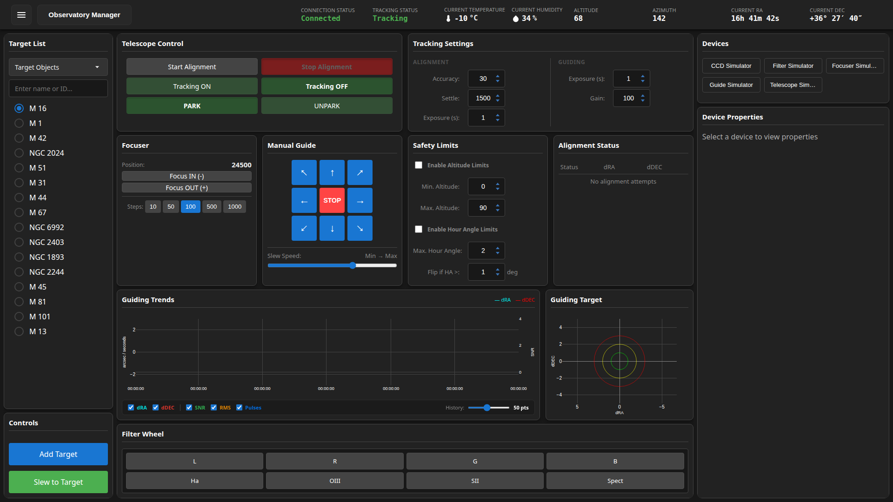
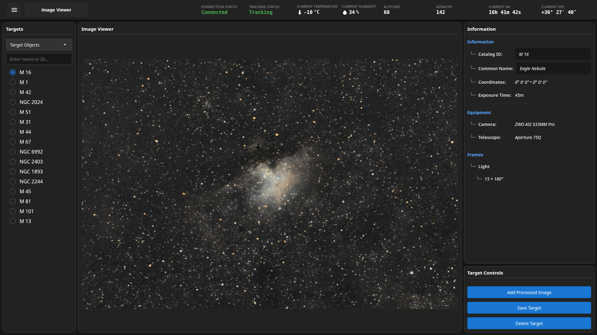
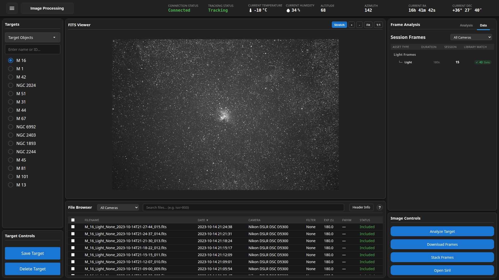
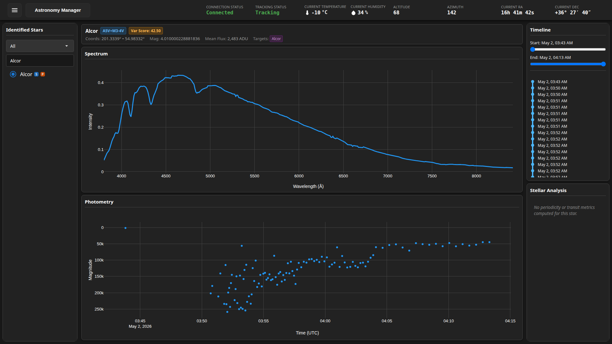
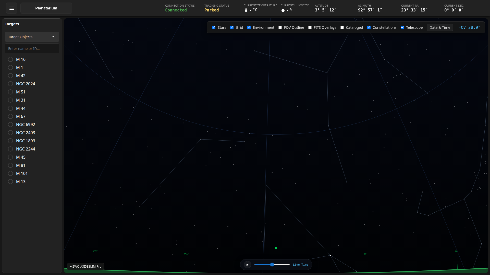

# Astrometrics User Interface: Desktop User Manual

*Version 2.2 · 2026-08-21 · Status: current*

## Overview

This manual is the desktop user guide for the Astrometrics application. The application provides real-time telescope telemetry, image inspection, science-grade calibration and stacking, photometric and 1D spectroscopic analysis, observation planning, and planetarium navigation.

---

## Table of Contents

- [1. Introduction](#1-introduction)
- [2. Getting Started & Setup](#2-getting-started--setup)
- [3. Interface Topology & Global Navigation](#3-interface-topology--global-navigation)
  - [3.1 Top Status Bar](#31-top-status-bar)
- [4. Image Viewer & Target Inspector (`TargetDisplay`)](#4-image-viewer--target-inspector-targetdisplay)
  - [4.1 Step-by-Step Instructions](#41-step-by-step-instructions)
- [5. Image Processing & Stacking (`ImageProcessingDisplay`)](#5-image-processing--stacking-imageprocessingdisplay)
  - [5.1 Step-by-Step Stacking Workflow](#51-step-by-step-stacking-workflow)
- [6. Astronomy Manager (`AstronomyDisplay`)](#6-astronomy-manager-astronomydisplay)
  - [6.1 Photometry & Transit Search](#61-photometry--transit-search)
  - [6.2 1D Spectroscopy Analysis](#62-1d-spectroscopy-analysis)
- [7. Observatory Manager (`ObservatoryDisplay`)](#7-observatory-manager-observatorydisplay)
  - [7.1 Control Panels & Operations](#71-control-panels--operations)
- [8. Planetarium & 3D Sky Map (`PlanetariumDisplay`)](#8-planetarium--3d-sky-map-planetariumdisplay)
  - [8.1 Sky Map Navigation & Controls](#81-sky-map-navigation--controls)
- [Appendices](#appendices)
  - [Appendix A: Telemetry Status Badges](#appendix-a-telemetry-status-badges)
  - [Appendix B: Display Capability Reference](#appendix-b-display-capability-reference)

---

## 1. Introduction

Astrometrics is an application that allows for the control of an observatory, the planning of imaging sessions, and the processing of astronomy photos in a single location. This manual provides a guide for using all of its features.

---

## 2. Getting Started & Setup

To launch the application, open a terminal and run:

```bash
./build/linux/run_astrometrics.sh start
```

This script will automatically start the interface, the backend engines, and connect to the observatory hardware.

---

## 3. Interface Topology & Global Navigation

The desktop workspace is divided into a persistent top **Status Bar** and a main viewport containing 6 displays.

### 3.1 Top Status Bar



The top bar is visible across all modes and provides instant system telemetry and navigation:

- **Settings Drawer (Gear Icon)**: Opens global configuration options (module toggles, backend URIs, logging verbosity).
- **Mode Dropdown Menu**: Click the current mode name (e.g., `Observatory Manager`) to switch between workspaces.
- **Connection Status**:
  - `Connected` (Green): Backend engine online.
  - `Disconnected` (Red): Engine offline; auto-reconnecting.
- **Tracking Status**: Shows live telescope motion (`Tracking`, `Slewing`, `Parked`, `Not Tracking`).
- **Telemetry Readouts**: Real-time Telescope Altitude/Azimuth, Target RA/Dec, Temperature (°C), and Humidity (%).

---

## 4. Image Viewer & Target Inspector (`TargetDisplay`)

The **Image Viewer** is the primary workspace for reviewing captured target packages, inspecting FITS image headers, adjusting visual stretching, and identifying catalog stars.



### 4.1 Step-by-Step Instructions

#### Opening and Selecting Images
1. Select a target from the **Targets** list in the left sidebar (e.g., `NGC 6992`, `M 16`, `M 42`).
2. Use the filter toggle buttons (`L`, `R`, `G`, `B`, `Ha`, `SPEC`) to filter frames by optical channel.
3. Click any image filename in the file tree to display it in the central canvas viewport.

#### Adjusting Canvas Stretch & Zoom
- **Pan**: Click and drag inside the main image canvas.
- **Zoom**: Scroll the mouse wheel or click the **Zoom Toolbar** buttons.
- **Stretch Algorithms**:
  - `Linear`: Standard raw pixel display.
  - `Asinh`: Preserves star color saturation in bright nebula cores.
  - `Logarithmic`: Enhances faint outer nebulosity.
  - `Histogram Equalization`: Maximizes contrast across dim fields.
- **Black / White Point Sliders**: Drag sliders under the viewport to adjust background clipping and saturation ceilings.

#### Inspecting FITS Headers & Star Profiles
- **FITS Header Inspector**: Type a keyword (e.g., `EXPTIME`, `GAIN`, `CRVAL1`) into the search bar in the right panel to view FITS header values.
- **Star Identification & PSF**: Click **Star ID** to overlay SIMBAD/Gaia catalog labels over detected stars and view measured Full-Width Half-Maximum (FWHM) values.

> [!TIP]
> Use the **Invert** function to flip black and white levels, which dramatically highlights faint satellite trails and cosmic ray strikes that may require rejection prior to stacking.

---

## 5. Image Processing & Stacking (`ImageProcessingDisplay`)

The **Image Processing** workbench provides calibration, alignment, quality selection, and frame stacking.



### 5.1 Step-by-Step Stacking Workflow

#### Step 1: Load Target & Calibration Frames
1. Select a science target from the left sidebar.
2. In the right panel under **Session Frames**, verify the light sub-exposures are loaded.
3. Under **Calibration Assets**, select matching Master Dark, Master Flat, and Master Bias files.

#### Step 2: Set Quality Filters
Use the **Frame Analysis** sliders to filter out degraded sub-exposures prior to stacking:
- **FWHM Cutoff**: Set maximum acceptable star width in arcseconds.
- **Roundness Floor**: Set minimum star roundness to reject wind-shaken frames.
- **Background Ceiling**: Exclude sub-exposures affected by satellite passes or cloud glow.

#### Step 3: Run Stacking Engine

Click **Process Target** to initiate stacking. Progress is shown on the live progress bar.

---

## 6. Astronomy Manager (`AstronomyDisplay`)

The **Astronomy Manager** provides tools for stellar photometry light curves and 1D spectroscopy analysis.



### 6.1 Photometry & Transit Search
1. **Load Target Data**: Select an identified variable star or exoplanet target from the sidebar list.
2. **Differential Photometry**: Choose up to 5 comparison stars in the field to normalize target brightness against atmospheric extinction.
3. **Exoplanet Transit Search (BLS)**:
   - Click **Run BLS Search**.
   - Enter min/max period bounds (e.g., 0.5 to 10.0 days).
   - The engine plots the folded phase light curve and displays the detected period, transit depth, and transit epoch.

### 6.2 1D Spectroscopy Analysis
1. Select a target with spectroscopic sub-exposures (`SPEC` filter tag).
2. **Aperture Extraction**: Click **Extract Profile** to trace the 1D spectrum from the 2D frame.
3. **Wavelength Calibration**: Match emission lines against Neon/Argon arc lamp lines to establish wavelength scaling (Å).
4. **Continuum Fitting & Line Identification**:
   - Fit spline/polynomial continuum baseline.
   - Identify Balmer absorption lines (e.g., H-alpha 6563 Å, H-beta 4861 Å).
5. **Equivalent Width**: Highlight an absorption or emission line to automatically calculate its equivalent width (line strength).

---

## 7. Observatory Manager (`ObservatoryDisplay`)

The **Observatory Manager** gives direct manual control over the telescope mount, focuser, filter wheel, autoguider, and weather safety systems.


### 7.1 Control Panels & Operations

#### Telescope Mount Control
- **Nudge Keypad**: Click `↑`, `↓`, `←`, `→` to manual nudge the mount. Adjust the **Slew Speed** slider from 1x (guide speed) to 600x (max slew).
- **Tracking Mode**: Toggle tracking `ON` or `OFF`. Select rate (`Sidereal`, `Lunar`, `Solar`).
- **Park / Unpark**: Click **PARK** to stow the mount in its home position; click **UNPARK** to enable slewing.

#### Mount Alignment & Iterative Solve History (`AlignmentStatus.tsx`)
- Inspect the **Alignment Status** log table to track iterative plate solving cycles.
- View status indicators (`solving` ⟳, `aligned` ✓, `warning` ⚠, `failed` ✗) along with coordinate deltas in arcseconds.

#### Focuser Step Control & Autofocus
- **Manual Nudge**: Click `Focus IN (-)` or `Focus OUT (+)` with step buttons (`10`, `50`, `100`, `500`, `1000`).
- **Autofocus Run**: Click **Start Autofocus** to measure stellar size across a V-curve and determine exact focus.

#### Guider Monitoring (PHD2)
- Inspect the live **Guiding Trends** chart to view real-time RA/Dec RMS errors in arcseconds.

> [!WARNING]
> **Safety Interlock.** Click the red **EMERGENCY STOP** button to immediately halt all hardware motion, park the mount, and force enclosure closure in case of imminent weather or mechanical failure.

### 7.2 Remote Target Ingestion

The Observatory Manager allows for discovering and downloading images captured by the remote hardware into the local library.

1. **Check for New Images**: Click the **Discover Remote Captures** button. The system will scan the telescope's onboard storage for new FITS files.
2. **Review Targets**: A list of unassociated remote targets will appear, displaying the target name, filter type, and number of sub-exposures.
3. **Download & Sync**: Select the desired targets and click **Download Selected**. The files will be transferred to the local machine and automatically registered into the Library Sidebar, ready for Image Processing.

*(For technical details on how the remote file protocols and target synchronizations are managed under the hood, see the {py:class}`~wayfindinglib.api.control_registry.ObservatoryControl` API Reference)*

---

## 8. Planetarium & 3D Sky Map (`PlanetariumDisplay`)

The **Planetarium** renders a 3D celestial sphere view of the sky above the observatory.



### 8.1 Sky Map Navigation & Controls
- **Rotate & Tilt**: Left-click and drag anywhere on the sky canvas.
- **Zoom**: Scroll the mouse wheel to zoom in or out.
- **Layer Checkboxes**: Toggle visible sky layers (Stars, Grid, Constellations, FOV Outline, Telescope).
- **Right-Click Context Menu**: Right-click any celestial object in the sky to slew the telescope.
- **Date & Time Controls**: Use the bottom time slider to simulate sky positions for future dates.

---

## Appendices

### Appendix A: Telemetry Status Badges

| Badge | Color | Meaning |
|---|---|---|
| `Connected` | Green | INDI hardware driver bus active and responsive. |
| `Disconnected` | Red | Server connection lost; auto-retrying. |
| `Tracking` | Green | Mount actively tracking at sidereal rate. |
| `Slewing` | Amber | Mount moving to new target coordinates. |
| `Parked` | Blue | Mount parked in safe home position. |
| `Safe State` | Red / Flashing | Emergency interlock active; motion suspended. |

### Appendix B: Display Capability Reference

| UI Display | Primary Functional Capabilities |
|---|---|
| `PlanetariumDisplay` | 3D WebGL Sky Map, Constellation overlays, FOV rectangle projection, object context slews. |
| `ObservatoryDisplay` | INDI device manager, mount slew/track/park keypad, alignment status attempt tracking (`AlignmentStatus.tsx`), focuser steps, autofocus V-curves, PHD2 RMS guider plots, weather interlocks. |
| `ImageProcessingDisplay` & `TargetDisplay` | FITS image inspection, header search, star FWHM/HFR measurement, Master Dark/Flat/Bias calibration, star alignment, Winsorized Sigma Clipping stacking. |
| `AstronomyDisplay` | 1D stellar profile extraction, neon/argon arc lamp wavelength calibration, continuum baseline fitting, Balmer line identification, Equivalent Width, and BLS exoplanet transit light curve fitting. |
